<!-- hero: monochrome ASCII portrait beside a short about-me panel.
     portrait: python scripts/prep_photo.py <photo> && python scripts/make_ascii_svg.py -->

<h3><code>derrickwzb@github ~ $ whoami</code></h3>

<table>
<tr>
<td valign="top"></td>
<td valign="top" align="left">

### 💫 About Me

- 🌱 Currently learning OS, Compilers and CUDA.
- 🚀 Building AI-powered projects and contributing to Open Source.
- 🎯 Goal: Create impact wherever i go.
- ✨ Big on financial markets and options trading.

### 💰 Wins
- 2026 : 56x on SPY call options

### 🌐 Socials
 

</td>
</tr>
</table>

 
 

<!-- animated contribution graph: real data, boxes reveal cell by cell
     (regenerated daily by .github/workflows/update-profile-art.yml) -->

<h3><code>derrickwzb@github ~ $ ./contributions.sh</code></h3>

 
 

<h3><code>derrickwzb@github ~ $ ./links.sh</code></h3>

<b>Low Level C++ Engineer · Full Stack Web Developer</b>

 

